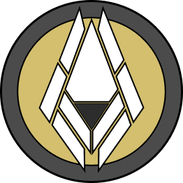

  

# ShapedCore
Ce projet sera un jeu en 2D style "shooter" uniquement écrit en javascript.

Le jeu étant aussi bien un apprentissage qu'un challenge, beaucoup d'éléments peuvent radicalement changer d'une mise à jour à l'autre. 
Cela vaut aussi pour la roadmap, les idées inscrites sont susceptibles d'évoluer voire d'être supprimée. 
Il existe tout de même une ligne directrice que suivront toutes les prochaines mises à jour et dont elles ne dévieront jamais.

---

__Concept central:__ 
- Chaque entité sera composée d'un noyau (ou plus) entouré de plusieurs parties qui le protégeront. 
- Ces parties seront destructibles et représenteront la santé restante de l'entité ainsi que ses capacités disponibles. 
- Chaque partie occupera une position bien définie par rapport au noyau et sera responsable de la possession ou non des capacités de l'entité. 
- Certaines capacités seront liées à plusieurs parties, de sorte que si le nombre de parties associées à une capacité est réduit, son efficacité diminuera également. 
- Une interface permettra de débloquer de nouvelles parties, et donc de nouvelles capacités, ainsi que des passifs en utilisant une monnaie récupérée sur les ennemis. 
- Un système de déviation de destruction pourra être activé, permettant de dévier la destruction d'une partie vers une autre. 
- Même avec des parties manquante une entité peut survivre mais sera certainement limité dans ses actions. 
- La destruction est totale si le noyau est touché une seule fois.

## Ressources

**[Structure du projet](./ProjectStructure.md)**

**[Systèmes de jeu](./Systems.md)**

**[Conception des niveaux](./Levels.md)**

**[Comportements des IA](./AI_Behaviors.md)**

**[Conception graphique 2D](./2DGraphicsDesign.md)**

**[Économie](./Economy.md)**

**[UI/UX](./UI-UX.md)**

**[Sound Design](./SoundDesign.md)**

**[Narration](./Narrative.md)**

**[Multijoueur](./Multiplayer.md)**

## Roadmap
🛠️ En développement 
⚠️ Correctif nécessaire 
📝 Planifié 
✅ Terminé 
🔄 Reporté 
❌ Annulé 

---

### Release v0.1.0:
| Version  | Objectif                                                  | État |
|:--------:|:----------------------------------------------------------|:----:|
| v0.0.1   | SAT.js par [jriecken](https://github.com/jriecken/sat-js) | ✅  |
| v0.0.2   | Définir la physique des entités                           | 🛠️  |
| v0.0.3   | Comportement IA basique                                   | 📝  |
| v0.0.4   | Première boucle de gameplay simple                        | 📝  |
| v0.0.5   | UI menu du jeu & UI outils de debug                       | 📝  |
| _        | Moteur 2D Matter.js                                       | ❌  |
| _        | Système de collision SAT                                  | ❌  |

__non assigné:__
| Objectif                                        | État |
|:------------------------------------------------|:----:|
| Renseigner les documents des aspects du jeu     | /    |

## License
Le projet ShapedCore est sous licence MIT.